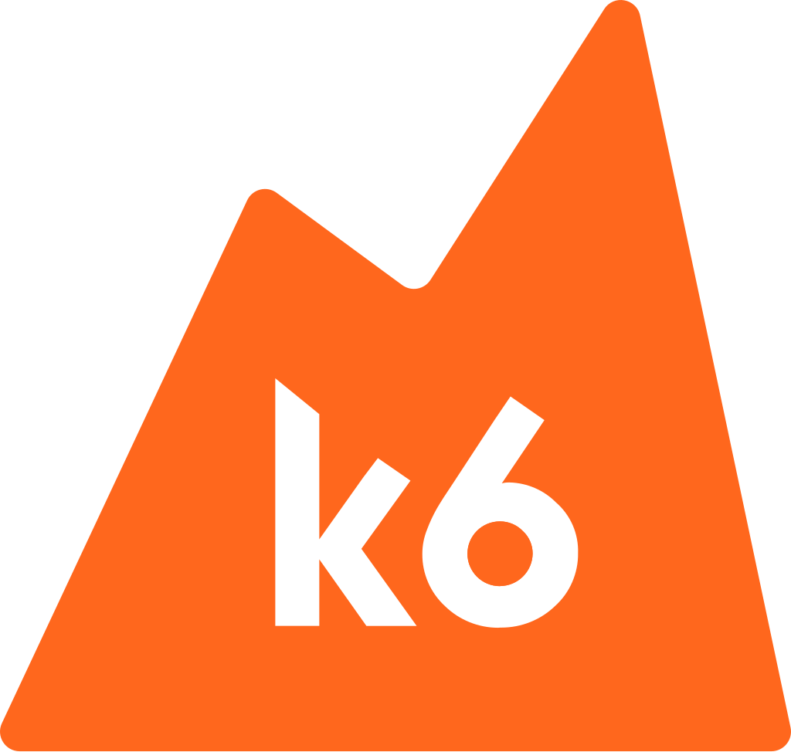

  <a href="https://grafana.com/oss/k6/">
    <picture>
       
    </picture>
     
    <picture>
      <source media="(prefers-color-scheme: dark)" srcset="assets/grafana-labs-dark-theme.svg">
      <source media="(prefers-color-scheme: light)" srcset="assets/grafana-labs.svg">
      
    </picture>
     
  </a>

<h3 align="center">Like unit testing, for performance</h3>

Modern load testing for developers and testers in the DevOps era.

# Grafana K6

- Load Testing
- API load testing
- Automated performance testing
- Load testing websites

# Installation
- MacOS
Homebrew: brew install k6

- Windows
Chocolatey: choco install k6
Winget : winget install k6 --source winget

## How To Usage
- create test case script with javascript (script.js)
-  k6 run script.js